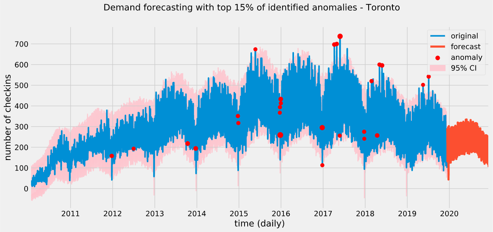

# YELP Merchant dashboard

- Developing a dashboard for YELP merchants using insights generated from big data analytics, machine learning and deep learning techniques

- The unique value of the product is to perform `time series forecasting` and `anomaly detection` on daily checkins of YELP businesses and to provide additional insights for anomalies using `natural language processing` techniques on user reviews

- The YELP dataset was used for the goals of this project. Link to dataset:
<https://www.kaggle.com/yelp-dataset/yelp-dataset>

- To explore the data science techniques involved in the making of the project, take a look at the following notebooks:
  - [Time series forecasting using ARIMA, Seasonal ARIMA, SARIMA with exogenous variables and Prophet](forecasting/time_series_forecasting.ipynb) ([view forecasts](images/forecasts_set1.png))
  - [Time series forecasting with Tensorflow using Linear, Dense and Convolutional neural networks](forecasting/time_series_forecasting_DNN.ipynb) ([view forecasts](images/forecasts_set2.png))
  - [Time series forecasting with Tensorflow using Recurrent neural networks](forecasting/time_series_forecasting_RNN.ipynb) ([view forecasts](images/forecasts_set3.png))
  - [Time series anomaly detection using Prophet](notebooks/anomaly_detection.ipynb)

- *note: datasets and models relevent for the dashboard are saved on a granular level to increase the dashboard refresh rate*

## Project achievements

- Explored multiple forecasting techniques and tested them to find best performing forecasting technique - `Prophet` works amazingly with the time series data due to its light weight nature and automatic inference of seasonalities and trends in data - more information at '[forecasting](forecasting)' folder
- Prophet confidence intervals were used to identify `anomalies` in the time series data

## Instructions

> ### downloading

- Setup kaggle on local system and download the dataset using

```bash
kaggle datasets download -d yelp-dataset/yelp-dataset -p /data
```

- Extract the files into '[data](data)' folder
- For documentation of the data, visit:
<https://www.yelp.com/dataset/documentation/main>

> ### dataset filter (*optional*)

- Setup Spark on your local system
- Run all cells in [filter_dataset.ipynb](filter_dataset.ipynb) notebook
- Filtered datasets will be stored in [filtered_data](filtered_data) folder
- *note: filtered datasets are already available for convenience*

> ### get forecast models and anomalies

```bash
python3 forecast_components.py
```

- Outputs:
  - prophet models trained individually on multiple time series and saved [*here*](dashboard_components/models)
  - time series dataframe and detected anomalies are stored [*here*](dashboard_components/data)

## Project steps with logic

> ### dataset filter: [filter_dataset.ipynb](filter_dataset.ipynb)

- Filtered the datasets using PySpark to contain only businesses from Top 10 Canadian cities with most number business checkins
- Dataset does not have a 'Country Code' to identify Canadian cities, so explored postal codes and identified codes of lengths 3,6,7 to be Canadian and filtered them
- Number of records in the filtered dataset can be found in the notebook
- Datasets are stored in a distributed format as parquet outputs
- *note: needs spark to be setup on the local system*

> ### time series forecasting: [forecasting](forecasting)

- Used daily aggregated time series data of number of checkins in all businesses within Toronto
- Explored different time series forecasting techniques using train, validation and test sets appropriately
- Evaluated model performances using MAPE (*Mean Average Precision Error*)


- Inferences:
  - Prophet works best with the data as it is light weight, needs very little tuning and captures the essence of the time series like trend and seasonality with high accuracy
  - Linear, Dense and Convolutional Neural Network models work well and the performance can be improved by tuning the hyperparameters, but they are heavy compared to Prophet as they need significant training and will not scale easily for multiple time series
  - RNN and LSTM models show poor performance as the number of training samples is significantly less - we can see its performance improvement on hourly aggregate version of data but that is out of the problem's scope

> ### time series anomaly detection: [anomaly_detection.ipynb](notebooks/anomaly_detectio.ipynb)

- Predicted confidence interval values for time series using Prophet model was used to detect anomalies and detected anomalies were tagged with importance based on their deviation from the confidence intervals


