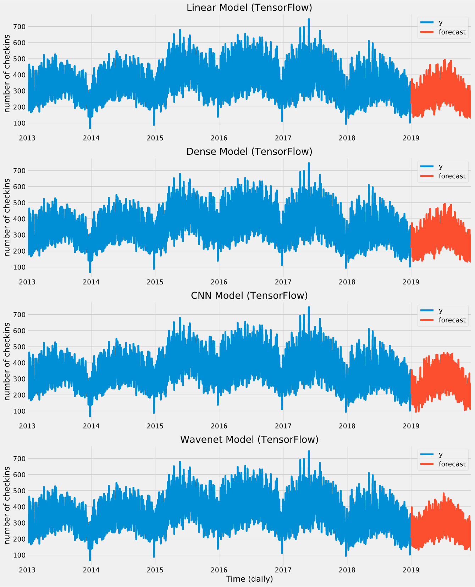

## Time series forecasting

- Used daily aggregated time series data of number of checkins in all businesses within Toronto
- Explored different time series forecasting techniques using train, validation and test sets appropriately
- Evaluated model performances using MAPE (*Mean Average Precision Error*)

> ### Notebooks

[time_series_forecasting.ipynb](time_series_forecasting.ipynb):

**Models tried**: Naive, Seasonal Persistance, ARIMA, SARIMA, SARIMAX, Prophet

- Tried monthly and daily aggregated time series
- Performed stationary test using `Augmented Dickey-Fuller` test on original and first differenced ts and observed that first differenced daily aggregated ts shows better stationarity
- Generated `ACF` and `PACF` plots of the time series to observe seasonality, AR and MA parameters
- Developed a `naive forecasting` model that forecasts value using y(t) = y(t-1) as baseline
- Developed a `seasonal persistance` model that forecasts value using y(t) = y(t-365)
- Grid searched `ARIMA` hyperparameters with d=1 and decided best model with AIC and BIC values
- Identified `weekly seasonality` in time series using ACF plot, grid searched `SARIMA` hyperparameters with d=1 and decided best model with AIC and BIC values
- Included `fourier transforms` as exogenous variables to add `yearly seasonality` to `SARIMAX` model and used auto_arima from pmdarima to identify best hyperparameters for forecasting
- Used default parameters of `Prophet` for forecasting
- Explored Prophet parameters and tuned them to improve model performance

[time_series_forecasting_DNN_CNN.ipynb](time_series_forecasting_DNN_CNN.ipynb)

[time_series_forecasting_RNN.ipynb](time_series_forecasting_RNN.ipynb)

> ### Model performances

> ### Inferences

- Prophet works best with the data as it is light weight, needs very little tuning and captures the essence of the time series like trend and seasonality with high accuracy
- Linear, Dense and Convolutional Neural Network models work well and the performance can be improved by tuning the hyperparameters, but they are heavy compared to Prophet as they need significant training and will not scale easily for multiple time series
- RNN and LSTM models show poor performance as the number of training samples is significantly less - we can see its performance improvement on hourly aggregate version of data but that is out of the problem's scope
